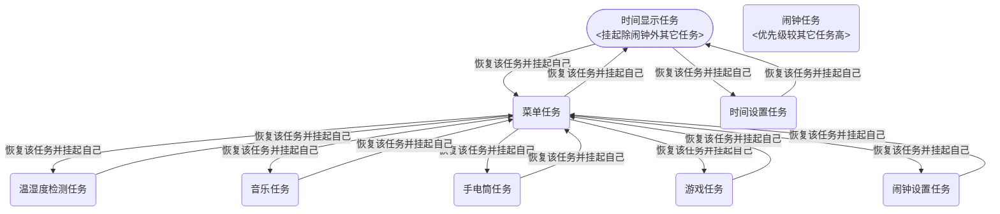

# 基于STM32F103C8T6和FreeRTOS的智能手表系统设计
## 1.项目概览
**项目演示:** https://b23.tv/vQvcexc

**功能列表:**
- 时间显示
- 时间设置
- 多级菜单导航
- 闹钟
- 三子棋游戏
- 手电筒
- 音乐
- 温湿度检测

## 2.硬件设计
**各模块引脚:**
|硬件模块|引脚|
|:---:|:---:|
|四个按键|PB11(Akey)、PB10(Bkey)、PB1(Ckey)、PB0(Dkey)|
|无源蜂鸣器(高电平触发)|PA3(闹钟蜂鸣器)、PA8(音乐蜂鸣器)|
|DHT11温湿度传感器|PA2|
|OLED显示屏|PB6、PB7(使用硬件I2C)|

**硬件接线图:**


---
注：PA0、PA1需保持悬空以获取随机AD值。

## 3.软件设计
>STM32开发用的HAL库
>
>OLED显示用的u8g2库
>
>u8g2库移植参考:https://blog.csdn.net/ciqujinnian_/article/details/134573231
>
>(这里说一下我移植u8g2库遇到的问题: Keil编译报错No space in execution......
>
>我的解决办法: 将FreeRTOSConfig.h里的configTOTAL_HEAP_SIZE改小一点)
>
>u8g2库的使用参考:https://blog.csdn.net/2302_80169672/article/details/144114179
>
>DHT11模块参考:https://blog.csdn.net/qq_50749196/article/details/137750417
>

**FreeRTOS任务流程图:**

---
说明：代码里还有一个testtask任务，是我偶尔测试用的，我在TimeTask也把它挂起来了可以不用管。除闹钟任务外所有任务优先级设为一样(我设的18)，闹钟任务优先级高一点(我设的23)。其中还创建了两个软件定时器，一个用来实现时间显示和闹钟，一个用来实现棋子待确定时以及设置闹钟或时间位时的闪烁频率，以及一个长度为1的队列，用来传递由定时器中断扫描得到的键值，任务从队列接收键值并执行相应操作。

**关键代码分析:**

- 按键模块
```c
if(htim->Instance == TIM3)
{
		static uint8_t Timecount;
		Timecount ++;
		if(Timecount == 20)
		{
			Timecount = 0;
			Key_ReleaseJudge();
		}
}
--------------------------------------
void Key_ReleaseJudge(void)
{
	static uint8_t NowState, LastState;
	LastState = NowState;
	NowState = Key_GetState();
	KeyNum keynum = {0, 0, 0, 0};
	
	if(LastState == 1 && NowState == 0)
	{
		keynum.Akey = 1;
		xQueueSendFromISR(KeyQueue, &keynum, 0);
	}
  ......
}
```
分析：这里我参考的B站江科大51单片机视频[12-2]，他后面也有视频专门讲这个定时器扫描按键，你们可以参考那个。通过定时器中断定期扫描按键实现非阻塞式消抖，当检测到按键松手便将其键值发送到队列。我编写的这个按键模块只支持单键而不支持组合键，所以存储键值的结构体也可以换成一个变量。

- 闹钟功能
```c
if(A_f_hour == f_hour && A_f_minute == f_minute && A_s_hour == s_hour && A_s_minute == s_minute && s_second == 0 
	&& f_second == 0)
{
	Beep(500, 5000);
	Alarm_working = 1;
}
---------------------------
void Beep(uint16_t freq, uint16_t duration_ms)
{
	if(freq == 0)
	{
		HAL_TIM_PWM_Stop(&htim2, TIM_CHANNEL_4);
		return;
	}

	uint32_t arr = (1000000 / freq) - 1;
	__HAL_TIM_SET_AUTORELOAD(&htim1, arr);
	__HAL_TIM_SET_COMPARE(&htim1, TIM_CHANNEL_1, arr / 2);
	HAL_TIM_PWM_Start(&htim2, TIM_CHANNEL_4);
	
	Beep_end_tick = HAL_GetTick() + duration_ms;
}
--------------------------------------------------
void AlarmTask(void *pvParameters)
{
	while(1)
	{
		if(Alarm_working && HAL_GetTick() >= Beep_end_tick)
		{
			HAL_TIM_PWM_Stop(&htim2, TIM_CHANNEL_4);
			Alarm_working = 0;
		}
		
		vTaskDelay(100);
	}
}
```
分析：在软件定时器回调函数中检测闹钟，闹钟触发时启动PWM并记录闹钟结束时间，高优先级闹钟任务循环检测Tick值，当到达所记录的闹钟结束时间，便关闭PWM让闹钟不再响。通过比较当前Tick值与目标Tick值实现非阻塞的时间控制。高优先级闹钟任务须使用vTaskDelay让出CPU不然其它任务就没执行机会了。

- 音乐功能
```c
void Music_Update(void)
{
	if(music_state != PLAYING){return;}
	
	uint16_t current_duration = (*current_melody)[current_note][1];
	uint32_t adjusted_time = HAL_GetTick() - paused_duration;  /*实现暂停后恢复时从原处开始播放*/
	if(adjusted_time - note_start_time >= current_duration)
	{
		__HAL_TIM_SET_COMPARE(&htim1, TIM_CHANNEL_1, 0);
		HAL_Delay(5);    /*模仿钢琴抬手的过程*/
		current_note ++;
		
		if((*current_melody)[current_note][0] == 0xFFFF)
		{
			Music_Stop();
			return;
		}
		
		Buzzer_PlayNote((*current_melody)[current_note][0]);
		note_start_time = adjusted_time + 5;
	}
}
```
分析：音乐原理参考B站江科大51单片机视频[11-1]。MusicTask任务循环调用Music_Update()，用来时刻更新音符播放状态，current_melody为定义的数组指针，指向用来存储乐谱的二维数组，paused_duration表示**累积**的暂停时间，adjusted_time为调整后的时间，使得暂停期间的时间不会被计入音符播放时间，将音符频率0xFFFF作为音乐播放结束的标志。

- 三子棋游戏功能
```c
void ComputerPlay(uint8_t Board[3][3])
{
	if(GameEndFlag == 0)
	{
		while(1)
		{
			ADCReady = 0;
			HAL_ADC_Start_DMA(&hadc1, (uint32_t*)RandomValues, 2);   /*ADC和DMA传输完成后会自动停止下次需要需再启动*/
			while(!ADCReady);  /*等待传输完成*/
			if(Board[RandomValues[0]%3][RandomValues[1]%3] == 0)   /*棋盘该位置没有棋子再下棋*/
			{
				Board[RandomValues[0]%3][RandomValues[1]%3] = 1;
				break;
			}
		}
	}
}
------------------------------------------------------
/* ADC转换完成回调函数 */
void HAL_ADC_ConvCpltCallback(ADC_HandleTypeDef* hadc)
{
   ADCReady = 1;  // 设置标志位
}
```
分析：将悬空的ADC引脚读取的随机噪声信号作为随机源，通过ADC转换和DMA传输将模拟噪声转换为数字值，再经取模运算得到0、1、2三个随机数。
